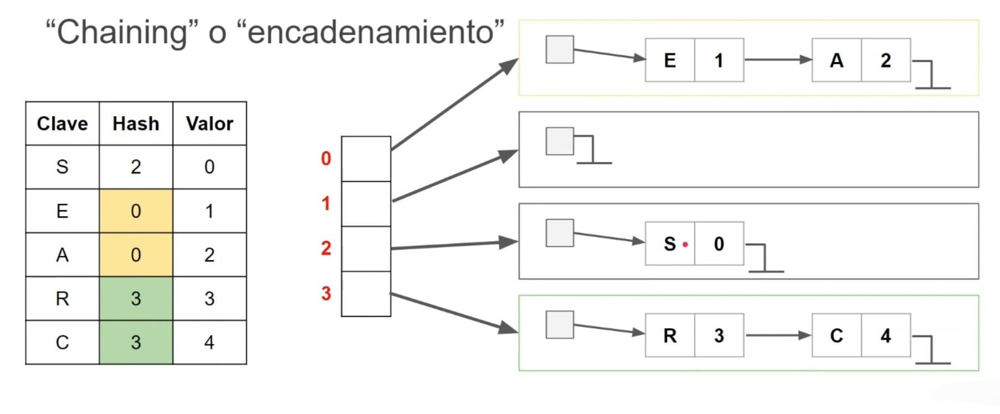
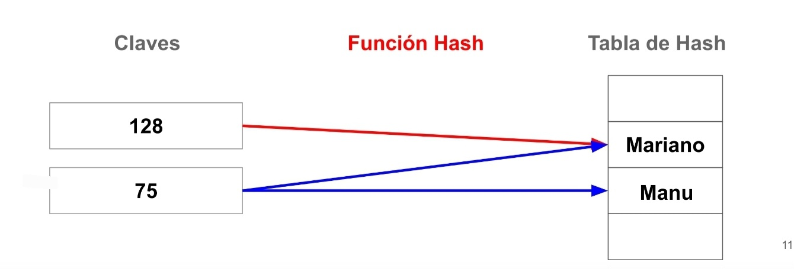

<div align="right">

</div>

# TDA HASH

## Repositorio de Marlene Elizabeth Gimenez Gauto - 110506 - gimenezzeli@gmail.com

- Para compilar:

```bash
gcc --leak-check=full --track-origins=yes --show-reachable=yes --error-exitcode=2 --show-leak-kinds=all --trace-children=yes -std=c99 -Wall -Wconversion -Wtype-limits -pedantic -Werror -O2 -g -o hash
```

- Para ejecutar:

```bash
./hash
```

- Para ejecutar con valgrind:
```bash
make valgrind-chanutron
```
---
##  Funcionamiento


<div align="center">

</div>

---

## Respuestas a las preguntas teóricas
- Qué es un diccionario
    Es una coleccion de pares (clave, valor). En el cual cuando se inserta/busca/elimina un elemento se lo hace mediante su clave. Esta clave funciona como un indice del diccinario. Debido a que la clave es unica, no hay duplicacion de entradas.  

- Qué es una función de hash y qué características debe tener
    La funcion de hash codifica la clave y la convierte en otra cosa, por ejemplo en un numero asociado. Una de sus caracteristicas principales es que la misma entrada debe dar la misma salida.

- Qué es una tabla de Hash y los diferentes métodos de resolución de colisiones vistos (encadenamiento, probing, zona de desborde)
    Una tabla de hash se utiliza para implementar un diccionario. Es una estructura que contiene valores y me permite hallar un valor a partir de una clave. Utilizando la funcion hash en distintas claves pueden que den el mismo valor de "hash", a esto se le llama coliciones. 
    Dependiendo como lidiamos con estas coliciones va a definir que tipo de hash estamos implementando:
    Direccionamiento cerrado -> Hash abierto
        En caso de colicion se crea "una lista enlazada".
    <div align="center">
    
    </div>

    Direccionamiento abierto -> Hash cerrado
        En caso  de colicion, sigo recorriendo el array hasta encontrar el proximo espacio libre.
    Probing lineal: busca el siguiente espacio libre inmediato
    <div align="center">
    
    </div>
   